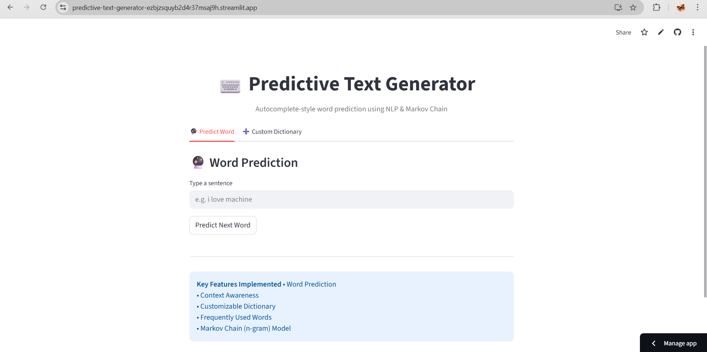
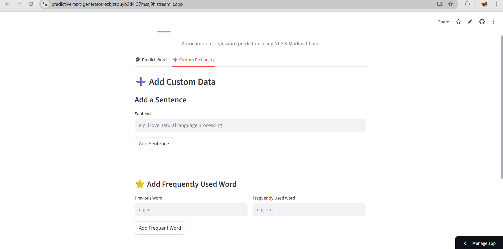

# 🧠 Predictive Text Generator using NLP

A **Predictive Text Generator** that suggests the next word based on user input, similar to autocomplete features in messaging applications.  
This project uses **Natural Language Processing (NLP)** techniques and a **bigram-based Markov Chain (n-gram model)** to generate context-aware word predictions.

---

## 📌 Features

- 🔮 **Word Prediction**  
  Predicts the next word based on previously typed words.

- 🧠 **Context Awareness**  
  Uses bigram (previous word → next word) relationships for better accuracy.

- ➕ **Customizable Dictionary**  
  Users can add their own sentences to improve predictions.

- ⭐ **Frequently Used Words**  
  Allows boosting the probability of commonly used words.

- ⚙️ **Lightweight ML Model**  
  Implements a simple and explainable **Markov Chain (n-gram)** model.

- 🌐 **Web Interface**  
  Interactive UI built using **Streamlit**.

---

## 🛠️ Tech Stack

- **Programming Language:** Python  
- **Concepts:** Natural Language Processing (NLP)  
- **ML Model:** Bigram-based Markov Chain  
- **Framework:** Streamlit  
- **Version Control:** Git & GitHub  

---

## 📂 Project Structure

    ```bash
     predictive-text-generator/
     │
     ├── app.py # Streamlit application
     ├── model.py # NLP & Markov Chain logic
     ├── requirements.txt # Python dependencies
     ├── .gitignore # Ignored files
     └── data/ # (Ignored) Large training datasets

---

## ▶️ How It Works

1. User types a sentence.
2. The last word is extracted.
3. A **bigram Markov model** predicts the most probable next word.
4. The user can:
   - Add new sentences
   - Add frequently used words
5. The model updates dynamically.

---

## 🚀 Running the Project Locally

### 1️⃣ Install dependencies
     ```bash
     pip install -r requirements.txt

### 2️⃣ Run the Streamlit app
     ```bash
     streamlit run app.py

---

## 🌐 Deployment

The application is deployed using Streamlit Community Cloud.

**Link:** https://predictive-text-generator-ezbjzsquyb2d4r37msaj9h.streamlit.app/

---

## 📊 Dataset Note

- Large datasets (e.g., Twitter Sentiment CSV) are not included in the repository due to GitHub size limits.

- The app uses default training sentences and supports real-time learning from user input.

- This follows industry best practices.

---

## 📸 Screenshots




---

## 📌 Future Enhancements

- Trigram or higher n-gram models

- Deep learning (LSTM / Transformer-based models)

- Model persistence using Pickle

- Multi-language support

---

## 👩‍💻 Author

- Yasmin Devaragattu
- GitHub: https://github.com/yasmin1714

---

## 📄 License

This project is for educational and internship purposes.
